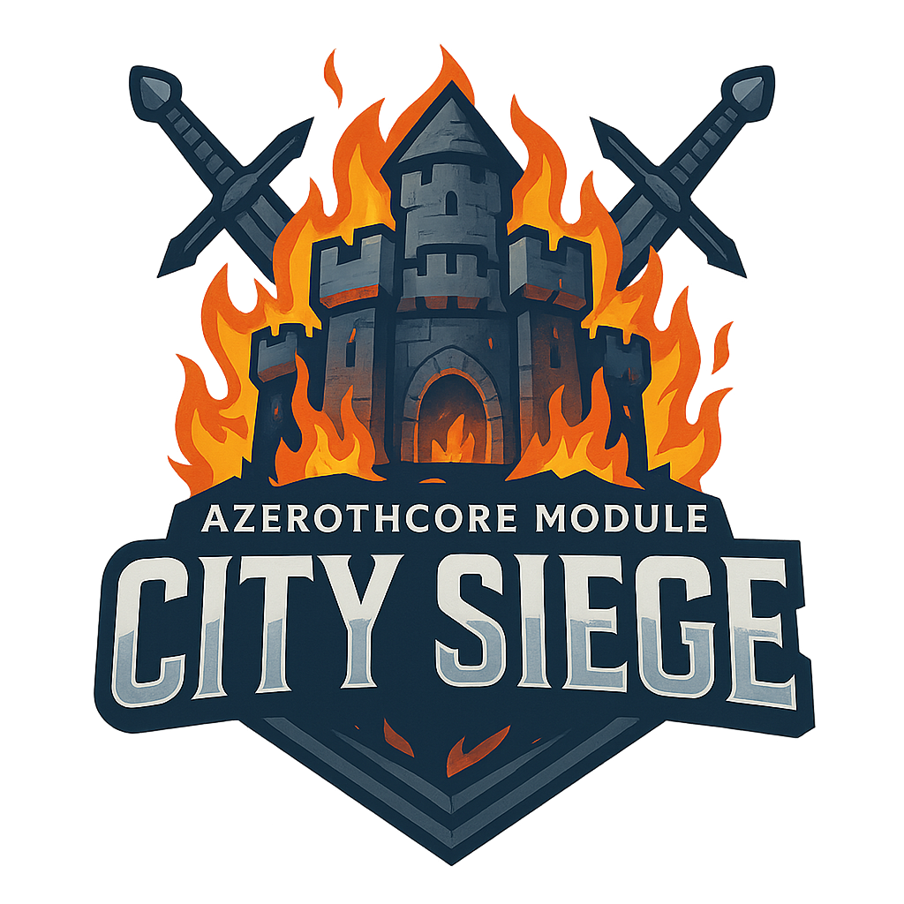

# AzerothCore Module: City Siege

<p align="center">
  
</p>

Overview
--------
The City Siege module for AzerothCore adds dynamic, timed siege events to all major cities in World of Warcraft. On a random, configurable timer, opposing faction forces assault a major city, spawning enemy units outside the city limits who march toward the city leader while engaging defenders. Enemy forces spawn at the city outskirts and use pathfinding and waypoints to march into the city, attacking the faction leader as their primary objective. 

**Both factions can win rewards:** Defenders earn rewards if they protect their city leader until the event ends, while attackers earn rewards if they successfully kill the city leader. This creates competitive PvE content where both Alliance and Horde players have incentive to participate. The module features fully configurable spawn locations, creature entries, reward scaling, and RP elements to create exciting world events that encourage faction participation and creates a more dynamic, living world experience.

> [!CAUTION]
> THIS MODULE IS IN ACTIVE DEVELOPMENT. IT PROBABLY WON’T WORK, WILL SOMETIMES WORK POORLY, AND MAY RANDOMLY DECIDE TO TAKE A VACATION. DO NOT USE ON AN ACTIVE SERVER OR EXPECT ANYTHING RESEMBLING RELIABILITY UNTIL THIS NOTICE IS GONE.

Features
--------
- **Dynamic Siege Events:**  
  Random timer-based events that bring warfare to major cities with configurable intervals.
- **All Major Cities Supported:**  
  Alliance: Stormwind, Ironforge, Darnassus, Exodar  
  Horde: Orgrimmar, Undercity, Thunder Bluff, Silvermoon
- **Intelligent Waypoint System:**  
  Siege units follow configurable waypoint paths to navigate through cities to reach their targets. Each city can have multiple waypoints configured for optimal pathing (e.g., Stormwind units go through main gate → trade district → keep entrance → throne room).
- **Dynamic Unit Respawning:**  
  Fallen siege units automatically respawn during active sieges with configurable respawn timers based on unit type (Leaders: 5 min, Mini-bosses: 3 min, Elites: 2 min, Minions: 1 min, Defenders: 45 sec). Attackers respawn at siege spawn point, defenders respawn near city leader. Creates sustained pressure throughout the event.
- **4-Tier Enemy System:**  
  Regular minions, Elite soldiers, Mini-bosses, and Faction leaders with configurable spawn counts, levels, and scale sizes.
- **City Defender System:**  
  Configurable defender units spawn near the city leader and march backwards through waypoints to meet attackers, creating dynamic frontlines throughout the city.
- **Strategic Spawning:**  
  Enemies spawn at configurable X/Y/Z locations outside each city (manually positioned at city gates) in tight formation and march toward the city leader.
- **Advanced Pathfinding:**  
  Siege units use server pathfinding with ground movement enforcement to navigate naturally through cities, avoiding obstacles and following proper paths. Includes automatic ground validation to prevent units from moving to invalid positions in mid-air or underground.
- **Waypoint Visualization:**  
  GM command to toggle tall beam-style markers showing spawn points, waypoint paths, and leader positions for easy diagnosis of pathfinding issues.
- **Cinematic RP Phase:**  
  Configurable delay (default 45s) where siege forces stand passive and yell RP messages before combat begins.
- **Periodic Yells:**  
  Leaders and mini-bosses yell threatening messages every 30 seconds during combat for immersion.
- **Configurable Creature Entries:**  
  All creature types (Alliance & Horde attackers + defenders) fully configurable in .conf file with customizable levels and scale sizes.
- **Visual Hierarchy:**  
  Leaders are 30% larger and Mini-bosses are 15% larger than regular units (configurable), making important targets easily identifiable in battle.
- **Flexible Event Timing:**  
  Configurable minimum (120min default) and maximum (240min default) intervals between events.
- **Event Duration Control:**  
  Configurable siege duration (default 30 minutes).
- **Single or Multiple Sieges:**  
  Choose whether only one city can be under siege at a time, or allow multiple simultaneous events.
- **Smart Announcements:**  
  Radius-based or world-wide announcements with color-coded messages.
- **City-Specific Configuration:**  
  Enable or disable events for individual cities.
- **Reward System:**  
  Automatic honor (100 default) and level-scaled gold rewards for winning faction players (base 50 silver + 50 silver per level).
- **Dual Victory Conditions:**  
  Defenders win if the city leader survives, attackers win if they kill the city leader. Both outcomes reward the winning faction.
- **Faction-Based Rewards:**  
  Only players of the winning faction receive rewards - defenders get rewards if they protect their city, attackers get rewards if they conquer it.
- **Automatic Cleanup:**  
  Creatures despawn after event ends, preventing database pollution.
- **Debug Mode:**  
  Comprehensive logging for server administrators.
- **Aggro Configuration:**  
  Separate toggles for player aggro and NPC aggro behavior.

Installation
------------
1. **Clone the Module**  
   Clone the module into your AzerothCore modules directory:
   
       cd /path/to/azerothcore/modules
       git clone https://github.com/DustinHendrickson/mod-city-siege.git

2. **Recompile AzerothCore**  
   Rebuild the project with the new module:
   
       cd /path/to/azerothcore
       mkdir build && cd build
       cmake .. -DCMAKE_INSTALL_PREFIX=/path/to/server
       make -j$(nproc)
       make install

3. **Configure the Module**  
   Copy the configuration file to your server's config directory:
   
       cp /path/to/azerothcore/modules/mod-city-siege/conf/mod_city_siege.conf.dist /path/to/server/etc/modules/mod_city_siege.conf

4. **Restart the Server**  
   Launch the world server:
   
       ./worldserver

GM Commands
-----------
Game Masters with `SEC_GAMEMASTER` security level have access to manual siege control commands. Administrators with `SEC_ADMINISTRATOR` level can also reload configuration. These commands allow you to trigger, stop, and manage siege events for testing or special events.

### Available Commands

- `.citysiege start [cityname]` - Manually start a siege event
- `.citysiege stop <cityname> <faction>` - Stop an active siege and declare a winner
- `.citysiege cleanup [cityname]` - Force cleanup of siege creatures
- `.citysiege status` - Display current siege events and module status
- `.citysiege testwaypoint` - Spawn a temporary test marker at your position (20 seconds)
- `.citysiege waypoints <cityname>` - Toggle visualization of siege waypoint path
- `.citysiege reload` - Reload configuration from file (Administrator only)

#### `.citysiege start [cityname]`
Starts a siege event immediately in the specified city or a random enabled city if no name is provided.

**Usage:**
```
.citysiege start                  # Start siege in random enabled city
.citysiege start Stormwind        # Start siege in Stormwind
.citysiege start orgrimmar        # Start siege in Orgrimmar (case-insensitive)
```

**Notes:**
- City name matching is case-insensitive
- Validates city exists and is enabled in configuration
- Will not start if a siege is already active in that city
- Respects `CitySiege.AllowMultipleCities` setting

#### `.citysiege stop <cityname> <alliance|horde>`
Stops an active siege event and declares a winner. The GM specifies which faction wins, and players of that faction receive rewards.

**Usage:**
```
.citysiege stop Stormwind alliance    # Alliance wins - all Alliance players get rewards
.citysiege stop Stormwind horde       # Horde wins - all Horde players get rewards
.citysiege stop Orgrimmar horde       # Horde wins - all Horde players get rewards
.citysiege stop Orgrimmar alliance    # Alliance wins - all Alliance players get rewards
```

**Notes:**
- **Faction parameter is required** - GM manually decides which faction wins the battle
- **Winning faction's players receive rewards** regardless of which city is under siege
- If Alliance wins: Alliance players within range get honor and gold
- If Horde wins: Horde players within range get honor and gold
- Losing faction receives no rewards
- Despawns all siege creatures
- Removes event from active list

#### `.citysiege cleanup [cityname]`
Force despawns all siege creatures and clears event data. Use this if a siege becomes stuck or has issues.

**Usage:**
```
.citysiege cleanup                # Cleanup all active sieges
.citysiege cleanup Darnassus      # Cleanup Darnassus siege only
```

**Notes:**
- Force removes creatures **without** reward distribution
- Clears all event data and timers
- Use this for troubleshooting problematic events
- Does not trigger normal end-of-event procedures
- No winner determination or rewards

#### `.citysiege status`
Displays the current status of the City Siege module and all active events.

**Usage:**
```
.citysiege status
```

**Output includes:**
- Module enabled/disabled state
- Number of active sieges
- Details for each active siege:
  - City name
  - Time remaining in the event
  - Number of creatures alive
- Time until next automatic siege event

#### `.citysiege testwaypoint`
Spawns a temporary waypoint marker at your current position for 20 seconds. Use this to preview and test waypoint positions before adding them to the config file.

**Usage:**
```
.citysiege testwaypoint            # Spawn test marker at current position
```

**Output:**
- Spawns a white spotlight beam (scale 2.5) at your location
- Displays your exact coordinates (X, Y, Z) with +1 yard Z buffer built-in
- Marker automatically despawns after 20 seconds

**Notes:**
- Stand where you want a waypoint, then use this command
- The marker shows exactly what the waypoint will look like
- **Z coordinate automatically includes +1 yard buffer** to prevent ground clipping
- Copy the displayed coordinates to your config file
- Perfect for building and testing waypoint paths
- The buffer prevents units from sinking into the ground during movement

#### `.citysiege waypoints <cityname>`
Toggles visualization of the siege waypoint path for a specific city. Shows tall beam-style markers to help diagnose pathfinding issues.

**Usage:**
```
.citysiege waypoints Stormwind     # Toggle waypoint visualization for Stormwind
.citysiege waypoints Darnassus     # Toggle waypoint visualization for Darnassus
```

**Visual Markers:**
- **Spawn Position** (scale 3.0): Large green spotlight beam marking attacker spawn point
- **Waypoint Path** (scale 2.5): Medium white spotlight beams marking each waypoint along the route
- **Leader Position** (scale 3.0): Large green spotlight beam marking where the leader stops (same as spawn)

**Output:**
- Shows how many waypoints are configured for the city
- Reports successful marker spawns and any failures
- Displays total marker count breakdown (spawn + waypoints + leader)
- Path guide: Spawn (Green/Large) -> Waypoints (White/Medium) -> Leader (Green/Large)

**Notes:**
- Run the command again to hide the waypoints
- Markers are visible from afar for easy diagnosis
- Large green beams mark start (spawn) and end (leader) positions
- Medium white beams mark the path waypoints in between
- Useful for identifying problematic waypoint positions
- Helps visualize the complete attack path
- Each city's waypoints can be toggled independently
- If markers are missing, check the output messages for spawn failures
- Enable debug mode to see detailed spawn logs in server console

#### `.citysiege reload`
Reloads all configuration values from `mod_city_siege.conf` without restarting the server. Allows you to make changes to waypoints, timers, spawn counts, and other settings on the fly.

**Usage:**
```
.citysiege reload
```

**What Gets Reloaded:**
- All timer settings (min/max spawn timer, event duration)
- Spawn counts (minions, elites, mini-bosses, leaders, defenders)
- Level and scale settings
- City enable/disable flags
- Waypoint configurations for all cities
- Spawn and leader positions
- Creature entry IDs
- Aggro and respawn settings
- Reward settings
- Messages and yells

**Output:**
- Confirmation message when reload is complete
- Displays current status (enabled/disabled, debug mode, timers, duration)
- Lists waypoint counts for each city that has waypoints configured
- Note about active sieges continuing with old settings

**Notes:**
- Requires Administrator security level (SEC_ADMINISTRATOR)
- Active sieges will continue using their original configuration
- Only new sieges started after reload will use updated settings
- Useful for testing different waypoint configurations without server restarts
- Perfect for adjusting spawn counts, timers, and other balance settings
- Changes to waypoints take effect immediately for new siege events

### Command Examples

```
# Test a siege event in Stormwind
.citysiege start Stormwind

# Check how the event is progressing
.citysiege status

# Building waypoint paths - spawn a test marker at your current position
.citysiege testwaypoint

# Visualize the complete waypoint path to diagnose pathing issues
.citysiege waypoints Stormwind

# Hide the waypoint markers when done diagnosing
.citysiege waypoints Stormwind

# Reload configuration after making changes to the .conf file
.citysiege reload

# GM observes and decides Alliance wins - Alliance players get rewards
.citysiege stop Stormwind alliance

# Or if GM decides Horde wins - Horde players get rewards
.citysiege stop Stormwind horde

# If creatures get stuck, force cleanup (no rewards, no winner)
.citysiege cleanup Stormwind
```

Configuration Options
---------------------
Customize the module's behavior by editing the `mod_city_siege.conf` file. All configuration options are detailed below.

### Core Settings

Setting                                | Description                                                                         | Default | Valid Values
---------------------------------------|-------------------------------------------------------------------------------------|---------|-----------------
CitySiege.Enabled                      | Enable/disable the module.                                                         | 1       | 0 (off) / 1 (on)
CitySiege.DebugMode                    | Enable debug logging for the City Siege module.                                    | 0       | 0 (off) / 1 (on)
CitySiege.TimerMin                     | Minimum time between events (minutes).                                             | 120     | Positive Integer
CitySiege.TimerMax                     | Maximum time between events (minutes).                                             | 240     | Positive Integer
CitySiege.EventDuration                | Duration of each siege (minutes).                                                  | 30      | Positive Integer
CitySiege.AllowMultipleCities          | Allow simultaneous sieges on multiple cities.                                      | 0       | 0 (single) / 1 (multiple)
CitySiege.AnnounceRadius               | Announcement radius in yards (0 = world-wide).                                     | 1500     | Non-negative Integer
CitySiege.MinimumLevel                 | Minimum player level to receive rewards.                                           | 1       | 1-80

### City-Specific Settings

Each major city can be individually enabled or disabled, and has configurable spawn locations:

Setting                                | City          | Default
---------------------------------------|---------------|--------
CitySiege.Stormwind.Enabled            | Stormwind     | 1
CitySiege.Stormwind.SpawnX/Y/Z         | Spawn coordinates | -8913.23, 554.633, 93.7944
CitySiege.Ironforge.Enabled            | Ironforge     | 1
CitySiege.Ironforge.SpawnX/Y/Z         | Spawn coordinates | -4981.25, -881.542, 501.660
CitySiege.Darnassus.Enabled            | Darnassus     | 1
CitySiege.Darnassus.SpawnX/Y/Z         | Spawn coordinates | 9947.52, 2482.73, 1316.21
CitySiege.Exodar.Enabled               | Exodar        | 1
CitySiege.Exodar.SpawnX/Y/Z            | Spawn coordinates | -3864.92, -11643.7, -137.644
CitySiege.Orgrimmar.Enabled            | Orgrimmar     | 1
CitySiege.Orgrimmar.SpawnX/Y/Z         | Spawn coordinates | 1633.75, -4439.39, 15.4396
CitySiege.Undercity.Enabled            | Undercity     | 1
CitySiege.Undercity.SpawnX/Y/Z         | Spawn coordinates | 1633.75, 240.167, -43.1034
CitySiege.ThunderBluff.Enabled         | Thunder Bluff | 1
CitySiege.ThunderBluff.SpawnX/Y/Z      | Spawn coordinates | -1043.11, 285.809, 135.165
CitySiege.Silvermoon.Enabled           | Silvermoon    | 1
CitySiege.Silvermoon.SpawnX/Y/Z        | Spawn coordinates | 9338.74, -7277.27, 13.7014

### Spawn Settings

Setting                                | Description                                    | Default
---------------------------------------|------------------------------------------------|--------
CitySiege.SpawnCount.Minions           | Number of regular attacker units.              | 15
CitySiege.SpawnCount.Elites            | Number of elite attacker units.                | 5
CitySiege.SpawnCount.MiniBosses        | Number of mini-bosses.                         | 2
CitySiege.SpawnCount.Leaders           | Number of faction leaders.                     | 1
CitySiege.AggroPlayers                 | Whether enemies aggro players.                 | 1
CitySiege.AggroNPCs                    | Whether enemies aggro city NPCs.               | 1

### Defender Settings

Setting                                | Description                                    | Default
---------------------------------------|------------------------------------------------|--------
CitySiege.Defenders.Enabled            | Enable/disable defender spawning.              | 1
CitySiege.Defenders.Count              | Number of city defender units to spawn.        | 10
CitySiege.Defenders.RespawnTime        | Respawn time for defenders (seconds).          | 45
CitySiege.Creature.Alliance.Defender   | Alliance defender creature entry ID.           | 17919
CitySiege.Creature.Horde.Defender      | Horde defender creature entry ID.              | 17932

### Creature Entry Settings

All creature entries are fully configurable:

Setting                                      | Description                    | Default
---------------------------------------------|--------------------------------|--------
CitySiege.Creature.Alliance.Minion           | Alliance attacker minion       | 17919
CitySiege.Creature.Alliance.Elite            | Alliance attacker elite        | 17920
CitySiege.Creature.Alliance.MiniBoss         | Alliance attacker mini-boss    | 17921
CitySiege.Creature.Alliance.Leader           | Alliance attacker leader       | 17928
CitySiege.Creature.Horde.Minion              | Horde attacker minion          | 17932
CitySiege.Creature.Horde.Elite               | Horde attacker elite           | 17933
CitySiege.Creature.Horde.MiniBoss            | Horde attacker mini-boss       | 17934
CitySiege.Creature.Horde.Leader              | Horde attacker leader          | 17936

### Level Settings

Configure the level of spawned siege units:

Setting                                | Description                                    | Default
---------------------------------------|------------------------------------------------|--------
CitySiege.Level.Leader                 | Level for attacker leaders.                    | 80
CitySiege.Level.MiniBoss               | Level for attacker mini-bosses.                | 80
CitySiege.Level.Elite                  | Level for attacker elites.                     | 75
CitySiege.Level.Minion                 | Level for attacker minions.                    | 70
CitySiege.Level.Defender               | Level for city defenders.                      | 70

### Scale Settings

Configure the visual size of siege units (1.0 = normal size):

Setting                                | Description                                    | Default
---------------------------------------|------------------------------------------------|--------
CitySiege.Scale.Leader                 | Scale multiplier for leaders.                  | 1.6 (60% larger)
CitySiege.Scale.MiniBoss               | Scale multiplier for mini-bosses.              | 1.3 (30% larger)

### Cinematic and RP Settings

Setting                                | Description                                           | Default
---------------------------------------|-------------------------------------------------------|--------
CitySiege.CinematicDelay               | Initial RP phase duration (seconds).                  | 45
CitySiege.YellFrequency                | How often leaders yell (seconds).                     | 30

### Respawn Settings

Setting                                | Description                                           | Default
---------------------------------------|-------------------------------------------------------|--------
CitySiege.Respawn.Enabled              | Enable automatic respawning during sieges.            | 1
CitySiege.Respawn.LeaderTime           | Respawn time for attacker leaders (seconds).          | 300 (5 min)
CitySiege.Respawn.MiniBossTime         | Respawn time for attacker mini-bosses (seconds).      | 180 (3 min)
CitySiege.Respawn.EliteTime            | Respawn time for attacker elites (seconds).           | 120 (2 min)
CitySiege.Respawn.MinionTime           | Respawn time for attacker minions (seconds).          | 60 (1 min)

### Waypoint Settings

Each city can have custom waypoints configured to guide siege units through the city:

Setting                                | Description                                           | Example
---------------------------------------|-------------------------------------------------------|--------
CitySiege.CITYNAME.WaypointCount       | Number of waypoints for this city (0 = direct path). | 3
CitySiege.CITYNAME.Waypoint1.X/Y/Z     | Coordinates for first waypoint.                       | -8829.0, 640.530, 94.11582
CitySiege.CITYNAME.Waypoint2.X/Y/Z     | Coordinates for second waypoint.                      | -8749.465, 560.5182, 97.400345
CitySiege.CITYNAME.WaypointN.X/Y/Z     | Additional waypoints as needed.                       | Continues for WaypointCount

**Example - Stormwind with 3 waypoints:**
```
CitySiege.Stormwind.WaypointCount = 3
CitySiege.Stormwind.Waypoint1.X = -8829.0
CitySiege.Stormwind.Waypoint1.Y = 640.530
CitySiege.Stormwind.Waypoint1.Z = 94.11582
CitySiege.Stormwind.Waypoint2.X = -8749.465
CitySiege.Stormwind.Waypoint2.Y = 560.5182
CitySiege.Stormwind.Waypoint2.Z = 97.400345
CitySiege.Stormwind.Waypoint3.X = -8609.125
CitySiege.Stormwind.Waypoint3.Y = 507.26778
CitySiege.Stormwind.Waypoint3.Z = 103.72089
```

**Notes:**
- Waypoints guide units through the city: Spawn → WP1 → WP2 → WP3 → Leader
- Units progress to next waypoint when within 10 yards of current waypoint
- Units resume movement to their current waypoint after combat ends
- Setting WaypointCount to 0 makes units path directly to the leader
- Use `.gps` command in-game to get coordinates for waypoints

### Reward Settings

Setting                                | Description                                           | Default
---------------------------------------|-------------------------------------------------------|--------
CitySiege.RewardOnDefense              | Enable rewards for defenders.                         | 1
CitySiege.RewardHonor                  | Honor points for successful defense.                  | 100
CitySiege.RewardGoldBase               | Base gold at level 1 in copper (50 silver = 5000).   | 5000
CitySiege.RewardGoldPerLevel           | Additional gold per player level in copper.           | 5000

### Announcement Messages

Setting                                | Description                                           | Default
---------------------------------------|-------------------------------------------------------|--------
CitySiege.Message.SiegeStart           | Message when siege begins (use %s for city name).     | \|cffff0000[City Siege]\|r The city of %s is under attack! Defenders are needed!
CitySiege.Message.SiegeEnd             | Message when siege ends (use %s for city name).       | \|cff00ff00[City Siege]\|r The siege of %s has ended!
CitySiege.Message.Reward               | Message sent to rewarded players (use %s for city).   | \|cff00ff00[City Siege]\|r You have been rewarded for defending %s!

### Creature Yells

Setting                                | Description                                           | Default
---------------------------------------|-------------------------------------------------------|--------
CitySiege.Yell.LeaderSpawn             | Message leaders yell when spawning.                   | This city will fall before our might!
CitySiege.Yell.Combat                  | Random combat yells (semicolon separated).            | Your defenses crumble!;This city will burn!;Face your doom!;None can stand against us!;Your leaders will fall!

How It Works
------------
### Event Flow

1. **Timer Phase:**  
   The module waits for a random interval between TimerMin and TimerMax.

2. **City Selection:**  
   A random enabled city is selected for siege. If AllowMultipleCities is disabled and a siege is already active, no new siege will start.

3. **Announcement:**  
   Players in range (or server-wide if AnnounceRadius = 0) are notified with a configurable message (default: color-coded with city name).

4. **Spawn Phase:**  
   **Attacker forces** spawn at the configured spawn location (set via SpawnX/Y/Z for each city) in tight circular formation:
   - Minions: 30 yards from spawn point (outermost ring)
   - Elites: 21 yards (70% radius from spawn point)
   - Mini-bosses: 15 yards (50% radius from spawn point)
   - Leaders: 10 yards from spawn point (center, leading the formation)
   
   **Defender forces** (if enabled) spawn in a 15-yard circle around the city leader position, ready to march out and meet the attackers.

5. **Cinematic Phase:**  
   For the configured delay (default 45 seconds), enemies remain passive and leaders yell RP messages configured in `CitySiege.Yell.LeaderSpawn`.

6. **Combat Phase:**  
   After the cinematic delay, units become aggressive and use advanced pathfinding to navigate through the city:
   - **Attackers** follow configured waypoint paths forward (e.g., Stormwind: main gate → trade district → keep entrance → throne room) marching toward the city leader
   - **Defenders** follow the same waypoints in **reverse order** (throne room → keep entrance → trade district → main gate) marching out to meet the attackers
   - Units engage hostile players or NPCs in their path based on aggro settings, then resume waypoint progression after combat
   - This creates dynamic frontlines that shift throughout the city as forces clash at different waypoints

7. **Respawn System:**  
   During active sieges, fallen units automatically respawn and rejoin the battle. Respawn times and locations vary by unit type:
   
   **Attackers** (respawn at siege spawn point):
   - Minions: 60 seconds
   - Elites: 120 seconds (2 minutes)
   - Mini-bosses: 180 seconds (3 minutes)
   - Leaders: 300 seconds (5 minutes)
   
   **Defenders** (respawn near city leader):
   - All defenders: 45 seconds (configurable)
   
   Respawned attackers reset to the first waypoint and march forward. Respawned defenders start at the last waypoint and march backward to meet the attackers.

8. **Periodic Yells:**  
   Every 30 seconds (configurable), leaders and mini-bosses yell threatening messages configured in `CitySiege.Yell.Combat`.

8. **Event Duration:**  
   The siege lasts for the configured duration (default 30 minutes).

9. **Victory Check:**  
   System verifies if the city leader survived using configured leader positions.

10. **Resolution:**  
    - **If Defenders Win** (city leader survives): Defending faction players receive rewards (Alliance for Alliance cities, Horde for Horde cities)
    - **If Attackers Win** (city leader killed): Attacking faction players receive rewards (Horde conquering Alliance cities, Alliance conquering Horde cities)
    - Creatures despawn and event ends

### Event Mechanics

- **Waypoint Navigation:**  
  Units follow configured waypoint paths through the city:
  - **Attackers** progress forward (Spawn → WP1 → WP2 → WP3 → Leader)
  - **Defenders** progress backward (Leader → WP3 → WP2 → WP1 → Spawn)
  - Units advance to the next waypoint when within 5 yards
  - After combat, units automatically resume movement to their current waypoint target
  - Creates dynamic battle lines that move through the city as forces meet

- **Respawn Mechanics:**  
  Dead units respawn after their configured timer expires:
  - **Attackers** respawn at the siege spawn point and restart at the first waypoint
  - **Defenders** respawn near the city leader and restart at the last waypoint
  - Respawned units maintain their configured level and scale
  - Respawning only occurs during active sieges and stops when the event ends
  - Creates sustained pressure and continuous waves of combat throughout the event

- **Ground Movement:**  
  All siege units use enforced ground movement with pathfinding to navigate naturally through cities. Units cannot fly, float, or clip through terrain.

- **Target Priority:**  
  Siege forces prioritize the city leader but will attack players and NPCs in their path based on aggro configuration.

- **Victory Conditions:**
  - **Defenders Win:** City leader survives the full event duration
  - **Attackers Win:** City leader is killed before event ends
  - Only the winning faction receives rewards

- **Automatic Rewards:**  
  Winning faction players within the configured radius receive:
  - Honor points (configurable, default 100)
  - Gold scaled by level: Base amount (default 50 silver at level 1) + additional gold per level (default 50 silver per level)
    * Example: Level 80 player receives 50 silver + (50 silver × 80) = 40.5 gold
  - Confirmation message (configurable)
  
- **Faction-Specific Rewards:**
  - Alliance cities (Stormwind, Ironforge, Darnassus, Exodar):
    * Alliance players rewarded if leader survives
    * Horde players rewarded if leader is killed
  - Horde cities (Orgrimmar, Undercity, Thunder Bluff, Silvermoon):
    * Horde players rewarded if leader survives
    * Alliance players rewarded if leader is killed

Customization
-------------
### Adding Custom Creatures

To use custom creatures for siege events:

1. Create or select creature entries in your database.
2. Update the `mod_city_siege.conf` file with your custom creature entry IDs.
3. Restart the worldserver for changes to take effect.

### Customizing Messages and Yells

All announcement messages and creature yells are configurable in `mod_city_siege.conf`:

1. **Announcement Messages:**  
   Edit `CitySiege.Message.SiegeStart`, `CitySiege.Message.SiegeEnd`, and `CitySiege.Message.Reward` to customize text. Use `%s` as a placeholder for the city name.

2. **Creature Yells:**  
   - `CitySiege.Yell.LeaderSpawn`: Message leaders yell when they spawn
   - `CitySiege.Yell.Combat`: Semicolon-separated list of random combat yells. Leaders and mini-bosses will randomly select one message to yell every 30 seconds (configurable via `CitySiege.YellFrequency`).

3. Restart the worldserver for changes to take effect.

Example custom combat yells:
```
CitySiege.Yell.Combat = "We will crush you!;Bow before us!;Your end is near!;Resistance is futile!"
```

### Adjusting Spawn Locations

Spawn coordinates for each city are fully configurable in `mod_city_siege.conf`:

1. Use `.gps` command in-game to get coordinates outside city gates.
2. Update `CitySiege.CITYNAME.SpawnX/Y/Z` in your config file.
3. Restart the worldserver for changes to take effect.

Example for Stormwind:
```
CitySiege.Stormwind.SpawnX = -8500.0
CitySiege.Stormwind.SpawnY = 600.0
CitySiege.Stormwind.SpawnZ = 95.0
```

Enemies will spawn in a 30-yard radius circular formation around this point.

### Configuring Waypoints

Waypoints allow you to create custom paths for siege units through each city:

1. **Enable waypoints for a city:**
   ```
   CitySiege.Stormwind.WaypointCount = 3
   ```

2. **Position yourself in-game** at key locations using `.gps` to get coordinates:
   - City entrance/gates
   - Main roads or districts
   - Near the leader location

3. **Use `.citysiege testwaypoint`** to preview the waypoint marker at your current position:
   - Spawns a temporary visual marker for 20 seconds
   - Displays exact coordinates to copy
   - Shows exactly how the waypoint will appear

4. **Add waypoint coordinates** to your config file:
   ```
   CitySiege.Stormwind.Waypoint1.X = -8829.0
   CitySiege.Stormwind.Waypoint1.Y = 640.530
   CitySiege.Stormwind.Waypoint1.Z = 94.11582
   ```

5. **Repeat for each waypoint** (numbered sequentially: Waypoint1, Waypoint2, Waypoint3, etc.)

6. **Restart the worldserver** for changes to take effect.

7. **Verify with `.citysiege waypoints CITYNAME`** to visualize the complete path.

**Tips:**
- Waypoints should form a logical path from spawn point to leader
- Space waypoints 50-100 yards apart for smooth movement
- Use `.citysiege testwaypoint` at each position before adding to config
- Use `.citysiege waypoints CITYNAME` to see the full path visualization
- Test with `.citysiege start CITYNAME` to verify pathing
- Set WaypointCount to 0 to disable waypoints and use direct pathing

Debugging
---------
To enable detailed debug logging, update the configuration file:

    CitySiege.DebugMode = 1

This will output comprehensive information about:
- Configuration loading (including waypoint paths)
- Event scheduling
- Creature spawning
- Waypoint progression (which waypoint each unit is moving toward)
- Respawn timers and respawn events
- AI state changes
- Reward distribution

Troubleshooting
---------------
> **Events are not starting.**  
> Ensure that `CitySiege.Enabled = 1` and at least one city is enabled in the configuration file. Check server logs for any errors.

> **No announcements appearing.**  
> Verify `CitySiege.AnnounceRadius` is set correctly. If using a radius value, ensure players are within range of the city center. Set to 0 for world-wide announcements.

> **Configuration changes not taking effect.**  
> Confirm the config file is in the correct location (`/path/to/server/etc/modules/mod_city_siege.conf`), check file permissions, and restart the worldserver after making changes.

> **Creatures not spawning.**  
> Enable debug mode and check logs for spawning errors. Verify that the configured creature entries exist in your database.

> **Creatures clipping through walls or ground.**  
> Ensure waypoints are configured for the city. Units need proper waypoint paths to navigate complex city layouts. Use `.gps` to get coordinates along the intended path and configure waypoints in the config file.

> **Creatures not moving or getting stuck.**  
> Check that waypoint coordinates are valid and accessible. Verify waypoints form a logical path with no obstructions. Enable debug mode to see which waypoint each unit is targeting. Use `.citysiege waypoints <cityname>` to visualize the complete path and identify problematic positions. The module includes automatic ground validation to prevent units from moving to invalid positions in mid-air or underground.

> **Respawned units not appearing.**  
> Verify `CitySiege.Respawn.Enabled = 1` in config. Check that the siege is still active (respawning stops when event ends). Enable debug mode to see respawn timer logs.

> **Rewards not being distributed.**  
> Ensure `CitySiege.RewardOnDefense = 1` and that players meet the minimum level requirement. Players must be within the announcement radius of the city center when the event ends successfully.

License
-------
This module is released under the GNU AGPL v3 license, consistent with AzerothCore's licensing model.

Credits
-------

Created by Dustin Hendrickson

Created for the AzerothCore Project.

Inspired by Classic WoW world events and city raids.

Contribution
------------
Pull requests and issues are welcome. Please ensure that contributions adhere to AzerothCore's coding standards and include appropriate documentation.
