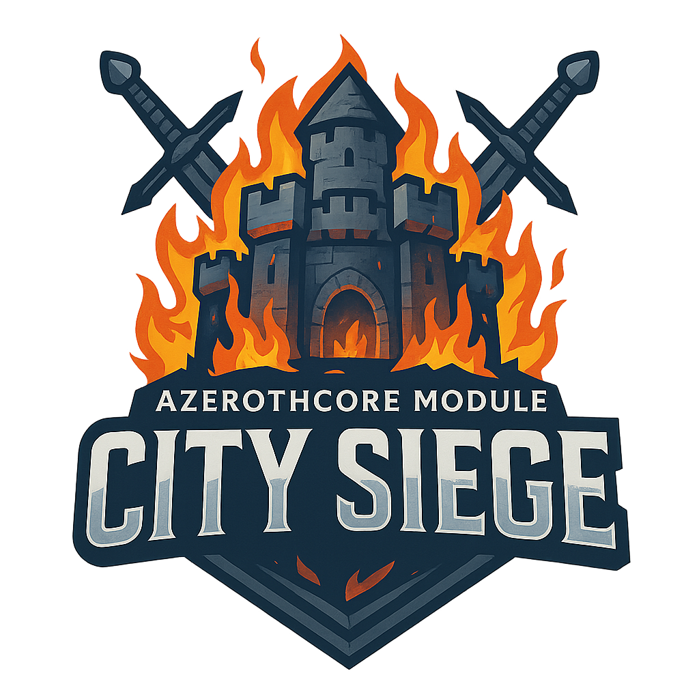

# AzerothCore Module: City Siege

An enemy war host musters outside one of the eight capitals, marches through its streets, and tries
to kill the city leader. Players of **any level** can turn up and fight, and the event scales itself
to whoever answers the call.



---

## What happens during a siege

| Stage | What you see |
|---|---|
| **Muster** | The war host forms up outside the gates. It is passive and immune while its warlord and officers deliver a randomly chosen roleplay script. The sky turns foul and a theme plays. A countdown warns the server. |
| **Assault** | The army is released and marches along its route toward the throne room, fighting anything hostile on the way. |
| **Breach** | Once the vanguard is a third of the way in, the city is told the gates are breached. |
| **Throne** | The vanguard reaches the city leader and engages them directly. Health callouts go out at 50%, 25% and 10%. |
| **Resolution** | The leader dies (attackers win) or the clock runs out (defenders win). Rewards go to everyone who actually fought, the top three combatants are named, weather and the leader are restored. |

---

## Highlights

- **No hand-placed waypoints.** Marching routes are generated from the server navmesh at runtime,
  for every city, and cached. See [Routing](#routing).
- **The host marches in ranks.** Every unit holds a fixed slot relative to the line of march, so the
  army arrives as ordered files rather than one pile of overlapping models. See
  [Formation](#formation).
- **Real leader targeting.** The throne position is read out of the `creature` table, so the siege
  always aims at where your city leader actually stands.
- **Scales to the players present.** The army's level is derived from who is near the city when the
  siege starts, and rank-and-file troops spawn across a level band.
- **Playable at any level.** A bracket handicap softens the blows an under-levelled defender takes
  and boosts the damage they deal, so a level 25 character can meaningfully help defend a level 80
  siege instead of being deleted at the gate.
- **Rewards for taking part, not for standing nearby.** Damage, healing and killing blows are
  tracked per player; honor, gold, experience and an optional item are handed out on that basis,
  with a reduced consolation reward for the losing side.
- **Optional client addon** with a live map, tracker and command panel.
- **Optional mod-playerbots integration** to fill both sides with bots.

---

## Installation

```bash
cd /path/to/azerothcore/modules
git clone <this-repo> mod-city-siege
cd ..
mkdir -p build && cd build
cmake .. -DCMAKE_INSTALL_PREFIX=$HOME/azeroth-server -DCMAKE_BUILD_TYPE=RelWithDebInfo \
  -DSCRIPTS=static -DMODULES=static
make -j$(nproc) && make install
```

Copy `mod_city_siege.conf.dist` to your config directory as `mod_city_siege.conf` and edit it there.
No SQL is required.

**mmaps are strongly recommended.** Automatic routing uses the server navmesh. Without mmaps the
module logs why routing failed and falls back to any manual waypoints you configured, or to a direct
march at the throne.

---

## Routing

`CitySiege.Route.Mode` selects how the army finds its way in:

- **`auto`** (default) — the module asks the navmesh for a walkable corridor from the muster point to
  the throne and turns its corners into waypoints. A single pathfinder call is capped at one
  corridor, so long marches are stitched together from several chained calls; that is what lets a
  route cross an entire city and climb into an interior throne room. Corridor corners are, by
  construction, connected by walkable ground, so the creatures' own pathfinding handles the hops
  between them cleanly.
- **`manual`** — use only the `CitySiege.<City>.WaypointN` entries in the config.
- **`direct`** — no waypoints; walk straight at the leader. Fine for open cities, poor for walls.

### Keeping the host on the roads

Left alone, the navmesh will march an army over the hillside next to a city gate. That is not a bug
in the mesh — it is asked for the shortest walkable line, open ground outside a capital *is*
walkable, and it has no concept of a road. Worse, `PathGenerator::CreateFilter()` grants every
walking creature both `NAV_GROUND` and `NAV_GROUND_STEEP`, so a grassy embankment looks exactly as
good as a paved street and the shorter one wins.

The mmap extractor already tags steep triangles as `NAV_GROUND_STEEP`; nothing was asking for it.
`CitySiege.Route.SteepCost` weights that terrain in the query filter, so the pathfinder pays more to
use it and takes the streets on its own — no per-city waypoints and no hand-drawn routes.

It is a cost rather than an exclusion on purpose. Banning steep ground outright would make any city
whose approach is a ramp — Thunder Bluff's rises, the climb to Ironforge's gate — fail to route at
all instead of taking the ramp. A high cost means *go around if there is a reasonable way around*,
which is what a marching column does, while still allowing the climb when it is the only way in.
`CitySiege.Route.WaterCost` does the same for canals and moats.

If a particular city should be entered a particular way, `CitySiege.<City>.Approach` lists points the
march must pass through. It is an override, not a requirement — the navmesh still finds the way
between consecutive anchors, so rough coordinates are enough.

Routes are built the first time a city is besieged and then cached for the lifetime of the server.
`.citysiege reload` and `.citysiege repath` clear the cache.

If routing fails, the reason is logged and shown by `.citysiege route <city>` — for example
*"Server has no mmaps for this area"* or *"Hit the 24-leg limit 240 yards short of the throne; raise
CitySiege.Route.MaxLegs."*

---

## Formation

Sending every unit to the same waypoint makes an army walk as a single clump. Instead, each unit is
assigned a **formation slot** when it spawns — a lateral offset and a depth, both measured relative
to the direction of march — and keeps it for the whole siege, including after it respawns.

The host forms up facing the first leg of its route: minions in front, elites behind them, then the
mini-bosses, with the warlord bringing up the rear. Each rank is laid out in rows
`CitySiege.Formation.Width` wide. When the army moves, a unit aims at *its own slot* projected onto
the current leg, not at the waypoint itself, so a rank arrives as a line. The garrison forms a single
wide line facing back down the route.

The formation collapses to half width for the final push at the throne, so nobody is shoved into a
wall in a tight room. Units that cannot reach their slot simply path as close as the navmesh allows —
`forceDestination` is off — and a stuck unit skips to the next node after 20 seconds.

Narrow-street cities look better with a smaller `CitySiege.Formation.Width` (3 rather than 5) and a
tighter `CitySiege.Formation.Spacing`.

---

## Commands

| Command | Access | Description |
|---|---|---|
| `.citysiege start [city]` | GM | Start a siege in the named city, or a random enabled one. |
| `.citysiege stop <city> [alliance\|horde]` | GM | End a siege. Without a faction the natural result (is the leader alive?) decides the winner. |
| `.citysiege cleanup [city]` | GM | Remove siege forces with no winner and no rewards. |
| `.citysiege status` | Player | Running sieges, stage, army level, leader health, participant count. |
| `.citysiege list` | Player | Every city: faction, enabled state, and its current route. |
| `.citysiege route <city>` | GM | Print the route, where it came from, and the last generation result. |
| `.citysiege repath <city\|all>` | GM | Rebuild the cached route. |
| `.citysiege showroute <city>` | GM | Place visible beacons along the route. Run again to remove them. |
| `.citysiege info` | GM | Inspect the selected siege unit: rank, level, route progress, current target. |
| `.citysiege here` | GM | Print your exact coordinates, for filling in muster points or manual waypoints. |
| `.citysiege mapdata <cityId>` | Player | Push route data to the client addon (used by the addon itself). |
| `.citysiege reload` | Admin | Reload the config, re-resolve leader positions, clear cached routes. |

```bash
.citysiege start Stormwind
```

```bash
.citysiege repath all
```

---

## Configuration

Every option is documented inline in `mod_city_siege.conf.dist`. The sections are:

| Section | What it covers |
|---|---|
| General | Master switch, siege timers, duration, muster length, announcement radius. |
| City selection | Which of the eight capitals can be besieged. All are enabled by default. |
| Route generation | `Route.Mode`, leader auto-detection, node spacing, budgets, terrain costs. |
| Muster points | Where each army forms up. |
| City leaders | Leader creature entry per city, plus fallback coordinates. |
| Manual waypoints | Legacy fallback, off by default. |
| Army composition | Rank counts, creature entries, warlord pools, aggro behaviour. |
| City garrison | Defender count and how far out they hold the line. |
| Marching formation | Slot spacing, rows per rank, and how far back each rank marches. |
| Level scaling | How the army's level is derived and how each rank sits relative to it. |
| Bracket handicap | Making the fight playable well below the army's level. |
| Reinforcements | Respawn timers per rank. |
| Rewards | Honor, gold, experience, items, participation thresholds. |
| Atmosphere | Weather override and music per phase. |
| Addon bridge | Transport and update rate for the client addon. |
| Text | Announcements, taunts and the roleplay scripts. |
| Playerbots | Bot recruitment limits (only active with mod-playerbots). |

### Level scaling in practice

When a siege starts, the module samples the levels of eligible players within
`CitySiege.Scaling.SampleRadius` of the city and takes the average of the upper half — so a few low
level alts parked at the bank do not trivialise the event. That value is clamped to
`Scaling.MinLevel`..`Scaling.MaxLevel` and becomes the **army level**. Each rank then sits at an
offset from it, and minions roll within a band below their offset so there is always something a
weaker defender can bring down.

Unlike a plain `SetLevel`, the module re-derives health, mana, damage and attack power from the
creature base stat tables, so the level actually means something.

### Bracket handicap

A player more than `Bracket.FreeLevels` below the army's level:

- takes reduced damage from siege units, floored at `Bracket.MinDamageTaken` of a normal hit;
- deals boosted damage to siege units, capped at `Bracket.MaxDamageBoost`.

Players at or near the army's level are unaffected. Set `CitySiege.Bracket.Enabled = 0` to turn the
whole mechanic off.

### Participation and rewards

Contribution is scored as `damage + healing/2 + 500 per killing blow`. Anyone above
`Reward.ParticipationThreshold` whose last contribution was within `Reward.ParticipationWindow` gets
rewarded — winners in full, losers scaled by `Reward.LoserFactor` if `Reward.LosingSide` is on.
Experience is the piece that makes the event worth joining while levelling; it is ignored at max
level.

---

## Client addon

`ClientAddon/CitySiege` is an optional addon built to match the 3.3.5 default UI. It has three tabs:
a live **Overview** (stage, countdown, leader health, force counts), a **Battle Map** showing the
generated route, and a GM **Commands** panel. Copy the `CitySiege` folder into
`World of Warcraft/Interface/AddOns/` — see [ClientAddon/README.md](ClientAddon/README.md).

The server sends state over a hidden addon message, so **players without the addon see nothing**. If
your client build does not deliver addon messages, set `CitySiege.Addon.UseSystemChannel = 1` to fall
back to the old visible-system-chat transport.

The message format is documented in [ClientAddon/PROTOCOL.md](ClientAddon/PROTOCOL.md).

---

## Playerbots

With `mod-playerbots` compiled in and `CitySiege.Playerbots.Enabled = 1`, free bots of each faction
are pulled in, flagged for PvP, sent along the same route as the NPC army, and returned to where they
were standing (with their roleplay strategy restored) when the siege ends. Grouped bots and bots in
instances are never recruited.

---

## Troubleshooting

**The army walks into walls or bunches at the gate.**
Check `.citysiege route <city>`. If the source says *direct* or *manual*, automatic routing failed —
the diagnostic line explains why. The usual cause is missing mmaps.

**The army climbs a hillside or crosses a wall instead of using the streets.**
Raise `CitySiege.Route.SteepCost`, then `.citysiege repath <city>`. The mesh treats a walkable slope
as an ordinary shortcut; that setting is what makes it pay for the privilege. Try 50, then 100. If
the route is cutting a canal rather than a hill, raise `CitySiege.Route.WaterCost` instead.

**Routing stops short of the throne.**
Read the diagnostic before changing anything — it reports how many approach segments completed and
how many corridor corners were reached. If the corner count does not change when you raise
`CitySiege.Route.MaxLegs`, the leg budget was never the limit and raising it further will not help;
the obstacle is terrain the filter is refusing. Lower `CitySiege.Route.SteepCost` in that case, or
set `CitySiege.<City>.Approach` to route the host in a way that exists.

**The siege never ends early.**
The city leader could not be found. Check the startup log; either the leader has no spawn in the
`creature` table on that map, or `CitySiege.<City>.LeaderEntry` is wrong. Without a leader the siege
simply runs to the timer.

**The army bunches up into a single blob.**
Formation slots are what prevent this, so check they are not disabled: `CitySiege.Formation.Spacing`
and `CitySiege.Formation.Width` must be above zero. In very tight interiors the navmesh may not have
room for the configured width, and units collapse onto the nearest reachable ground — lower
`CitySiege.Formation.Width` to 3 for those cities.

**Low level players get flattened.**
Raise `CitySiege.Bracket.MinDamageTaken`, or lower `CitySiege.Scaling.MaxLevel`.

**Sieges feel too easy.**
Raise the health multipliers, the rank counts, or `CitySiege.Level.*Offset`.

Turn on `CitySiege.DebugMode` for per-node route logging and detailed spawn output.

---

## License

GNU AGPL v3. See [LICENSE](LICENSE).
